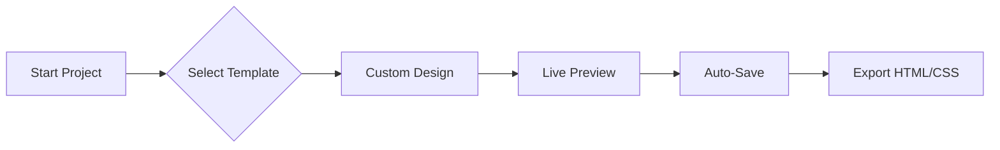

# TWB — Template Website Builder

A professional, high-performance drag-and-drop website builder designed for speed, precision, and ease of use. Build stunning, responsive websites in minutes with a clean, modern interface inspired by top-tier tools like Webflow and Wix.



## ✨ Key Features

- **Hybrid Layout Engine**: Supports both Freeform (Absolute Positioning like Wix/Figma) for maximum creative freedom and CSS Flow (Relative/Flexbox like Webflow) for structured components.
- **Infinite Canvas Workspace**: Edge-to-edge design area with a realistic full-page viewport, allowing you to build and preview naturally without layout constraints.
- **Modern Clean UI**: A sleek, beautifully crafted Light Mode interface with glassmorphism elements, collapsible categorized sidebars, and an intuitive floating toolbar.
- **Advanced State Management**: Preview and edit specific pseudo-classes live on the canvas, such as `Normal`, `Hover`, and `Active` states.
- **Navigator (Layers) Panel**: Manage complex designs effortlessly with a hierarchical view of all components, drag-to-reorder, and pin/unpin tools.
- **Pre-built Templates & Sections**: Jumpstart your project with imported professional-grade templates, Hero sections, Feature grids, and more.
- **Responsive Workspace**: Design flawlessly across all devices with instant toggles for Desktop, Tablet, and Mobile views.
- **History & Recovery**: Reliable Undo/Redo system to experiment with designs safely and save snapshots.
- **Data Export**: Export your design directly to clean, production-ready HTML/CSS, or download the raw JSON schema.

## 🛠️ Tech Stack

- **Frontend**: React.js, React DnD (Drag and Drop), CSS Modules, HTML5 Canvas concepts.
- **Backend**: Node.js, Express.js.
- **Database**: MongoDB (Mongoose) for Projects and Templates storage.
- **Icons & Fonts**: Font Awesome 5, Google Fonts API Integration.

## 🚀 Getting Started

### Prerequisites

- Node.js (v16+)
- MongoDB (running locally or a Cloud URI cluster)

### Installation

1. **Clone the repository**:
   ```bash
   git clone https://github.com/Fremen0/website-builder.git
   cd website-builder
   ```

2. **Automated Setup (Recommended)**:
   Run the included bash script to instantly install all dependencies and setup the default environment variables.
   ```bash
   ./install.sh
   ```

   **OR Manual Setup**:
   ```bash
   # Install client and server dependencies
   cd client && npm install
   cd ../server && npm install
   
   # Create a .env file in the /server directory
   echo "MONGO_URI=mongodb://localhost:27017/website-builder" > server/.env
   echo "PORT=5000" >> server/.env
   ```

4. **Running the Application**:
   ```bash
   # Run Backend (from /server directory)
   npm run dev
   
   # Run Frontend (from /client directory)
   npm start
   ```

## 📸 Screenshots


## 📄 License

MIT License. Open source and free to use!
