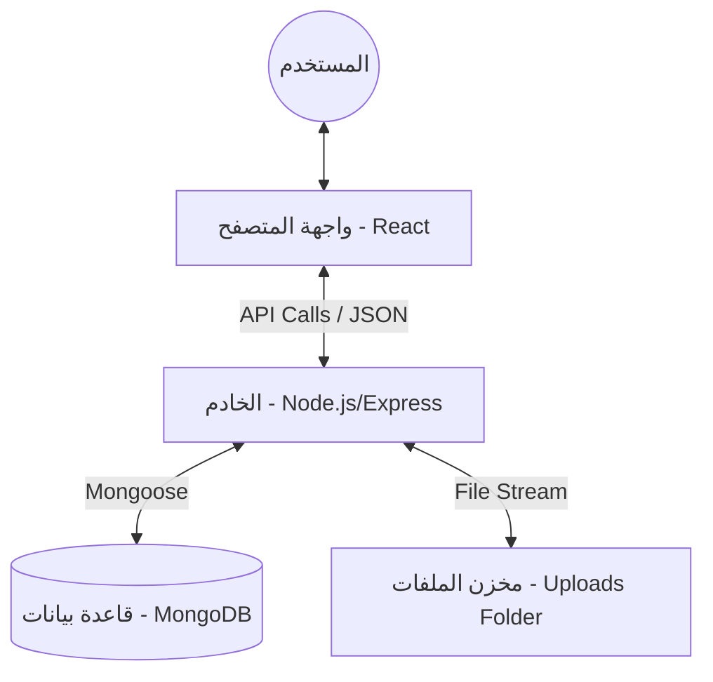
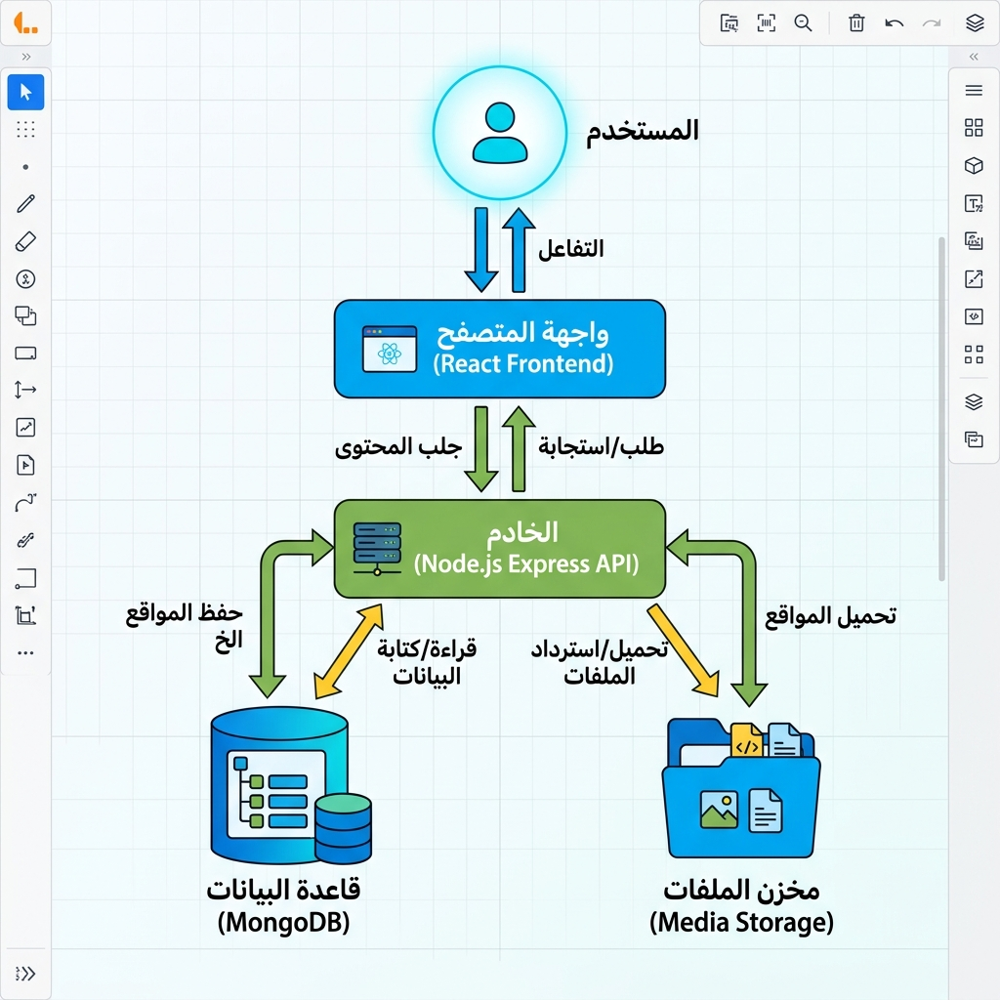
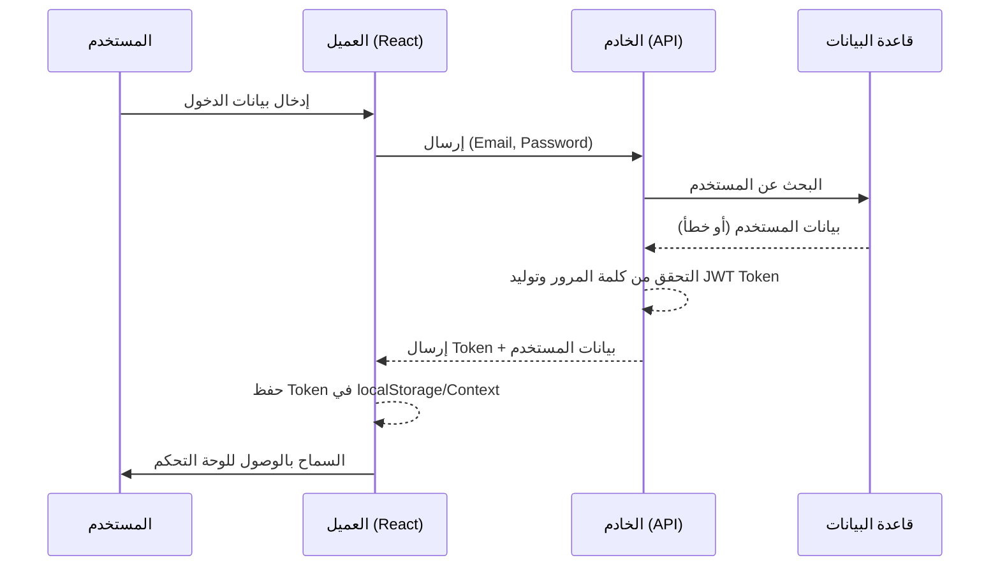
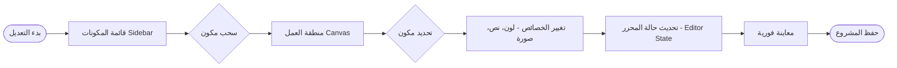
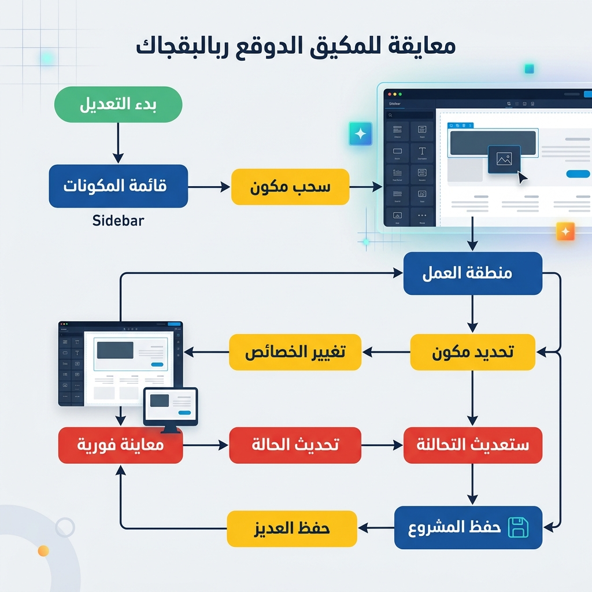
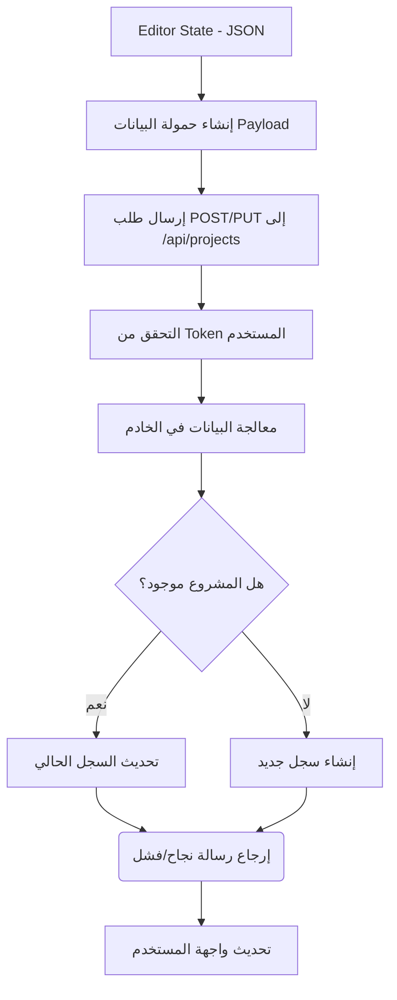
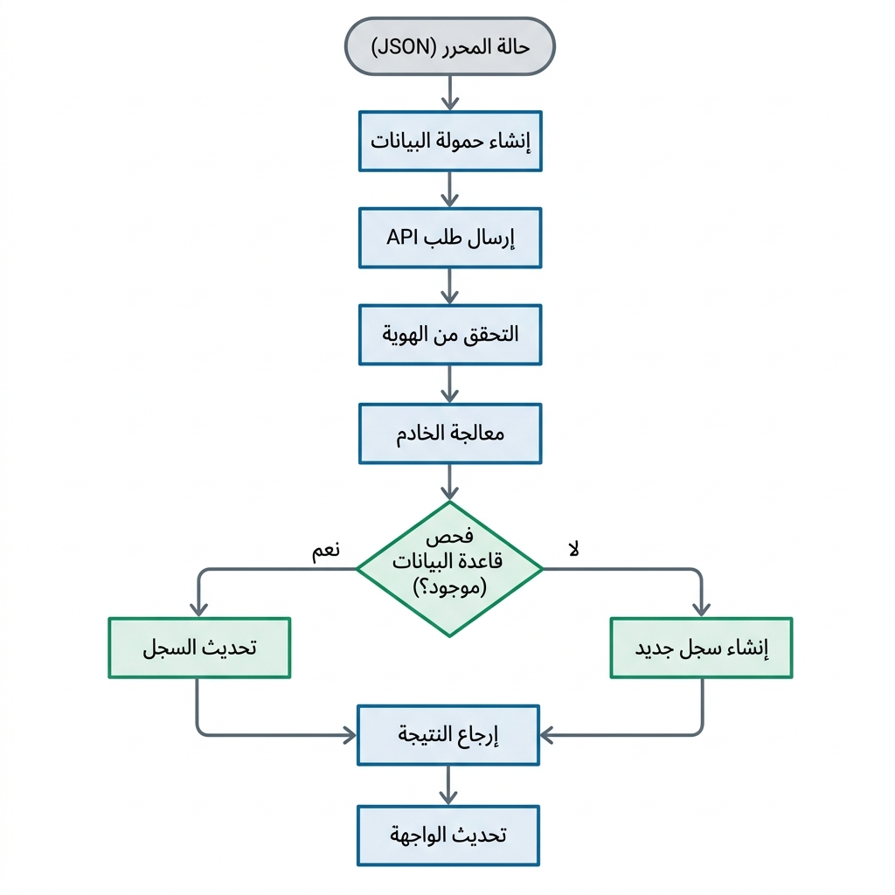
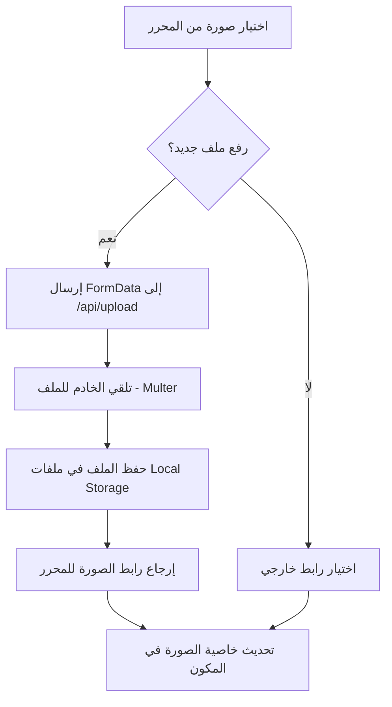

# مخططات سير العمل للمشروع (Flow Charts)

يحتوي هذا المستند على مخططات سير العمل الرئيسية لمشروع **باني المواقع (Website Builder)**، وهو يوضح التفاعل بين المكونات والأدوار المختلفة داخل النظام.

---

## 1. الهيكل العام للنظام (System Architecture)

يوضح هذا المخطط العلاقة بين واجهة المستخدم (Client) والحادم (Server) وقاعدة البيانات (Database).

---

## 2. سير عملية التوثيق والتحقق (Authentication Flow)

يوضح كيفية دخول المستخدم إلى النظام والتحقق من هويته.

---

## 3. منطق المحرر (Editor Logic Flow)

يوضح كيفية عمل محرر المواقع بخاصية "السحب والإفلات" (Drag and Drop).

---

## 4. دورة حياة حفظ المشروع (Project Saving Workflow)

يوضح كيفية انتقال البيانات من حالة المتصفح إلى التخزين الدائم.

---

## 5. رفع الملفات والصور (Media Upload Flow)

