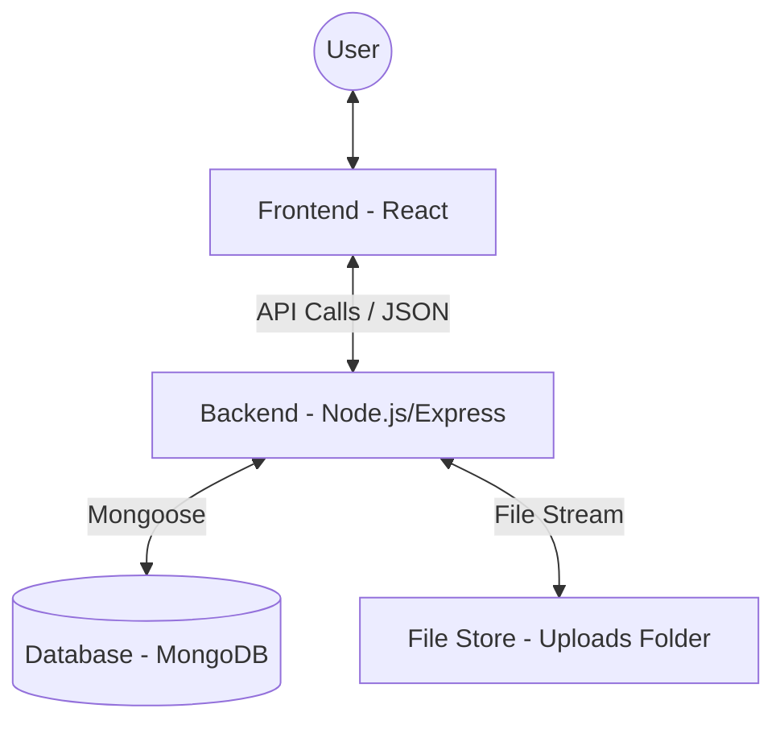
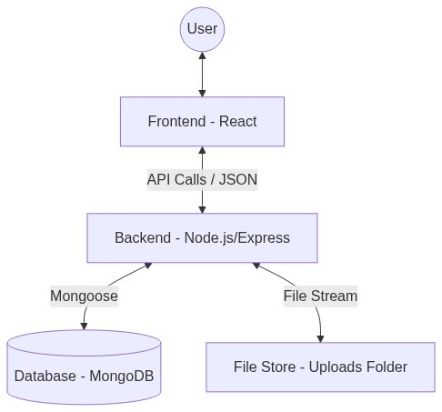
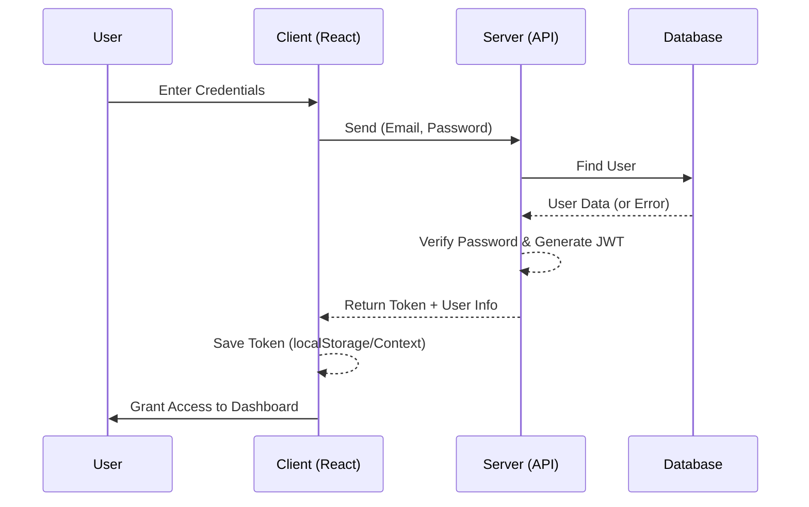
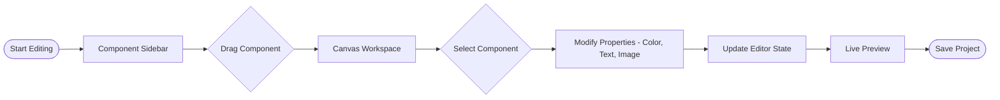
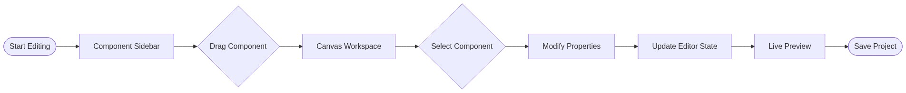
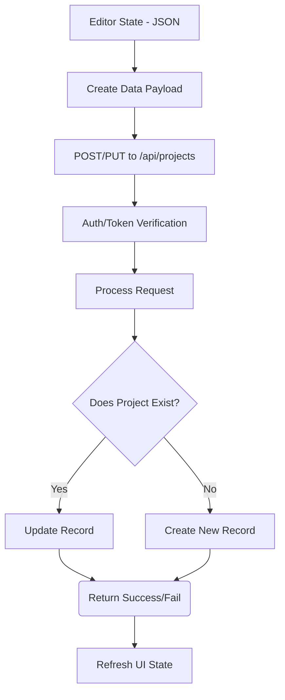
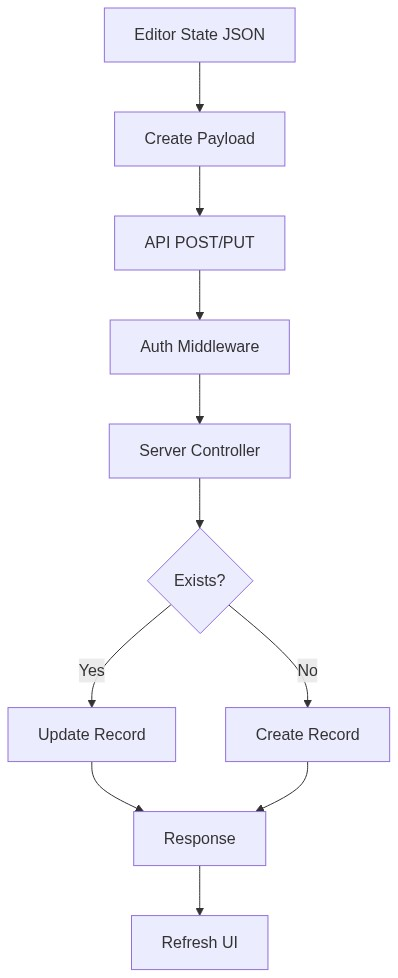
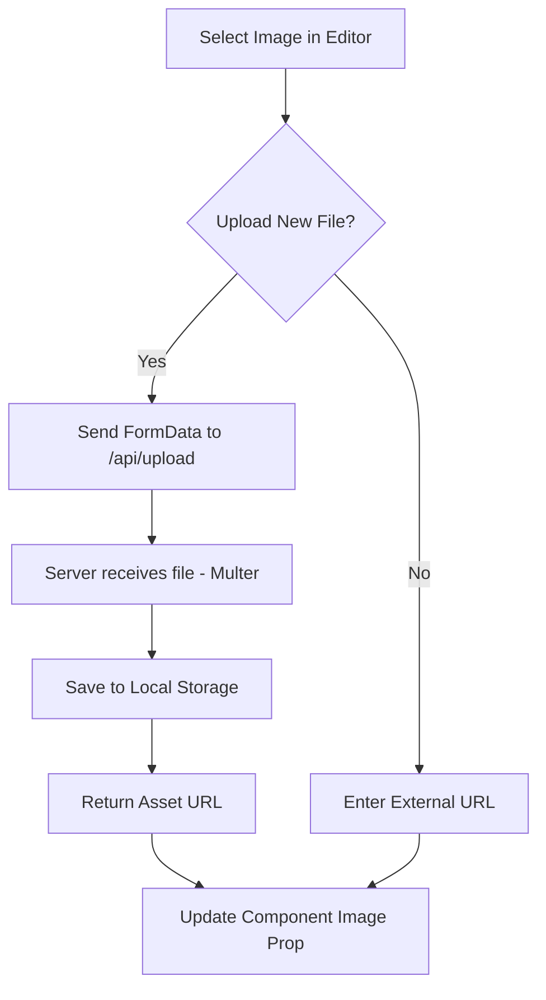

# Project Flowcharts

This document contains the main flowcharts for the **Website Builder** project, illustrating the interactions between different components and roles within the system.

---

## 1. System Architecture

This diagram shows the relationship between the User, React Frontend, Node.js Server, and MongoDB Database.

---

## 2. Authentication Flow

Illustrates how users access the system and verify their identity.

---

## 3. Editor Logic Flow

Shows how the "Drag and Drop" builder works on the client side.

---

## 4. Project Saving Workflow

The transition of data from the store state to persistent storage.

---

## 5. Media Upload Flow

